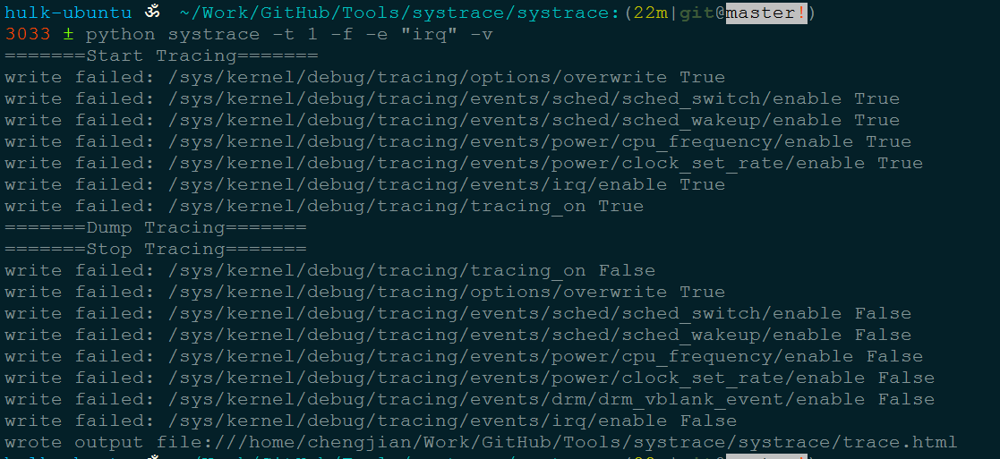
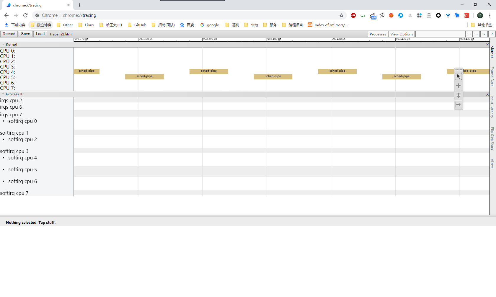
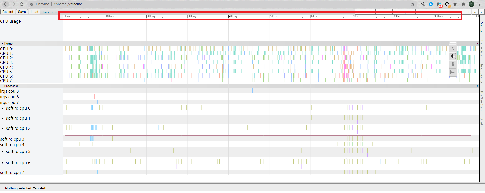

This is systrace script for Linux Desktop/Server

# 1 Description
-------


## 1.1 Usage
-------

python systrace -h


Usage: systrace [options]

Options:

| options | description |
|:-------:|:-----------:|
| -h, --help | show this help message and exit	|
| -o FILE		| write HTML to FILE	|
| -t N, --time=N	| trace for N seconds	|
| -b N, --buf-size=N	| use a trace buffer size of N KB	|
| -d, --disk		| trace disk I/O (requires root)	|
| -f, --cpu-freq	| trace CPU frequency changes		|
| -i, --cpu-idle	| trace CPU idle events			|
| -l, --cpu-load	| trace CPU load			|
| -s, --no-cpu-sched	| inhibit tracing CPU scheduler (allows longer trace times by reducing data rate into buffer) |
| -w, --workqueue	| trace the kernel workqueues (requires root)	|
| -g, --gpu		| trace GPU events				|
| -e TRACE_EVENT, --trace-event=TRACE_EVENT | trace Custom events	|


## 1.2 DONE
-------

add ext4/block request parser from old systrace


## 1.3 TODO
-------

  add userspace support library
  integrate with policykit
  ftrace_tracing_mark

# 2 USE
-------

## 2.1 systrace
-------


```cpp
python systrace -t 1 -v -e "sched,irq"
```



open your chrome tracing page chrome://tracing

Drag trace.html into the chrome window




## 2.2 fix_time
-------

We can see that the time shown in the Trace-Viewer(systrace)
is relative-time,



However, the time displayed in the ftrace dumping is the system
time(absolute time).


Use the script `fix_time.pl` to adjust absolute-time to relative-time.

```cpp
perl scripts/fix_time.pl ./trace.html  trace.html.js
```

The relative time is shown in the output file `trace.html.js`


# 3 Reference
-------

[Parser for Linux Ftrace (Android Systrace) logs for system power & performance analysis.](https://github.com/corakwue/ftrace/tree/master/ftrace)

[Unity Systrace Plugin for Android](https://github.com/Over17/UnitySystracePlugin)

[Systrace Analysis Tool](https://github.com/Lynazhang/systrace_analysis_tool)

[Systrace scripts](https://github.com/zhangdongfeng/systrace)
